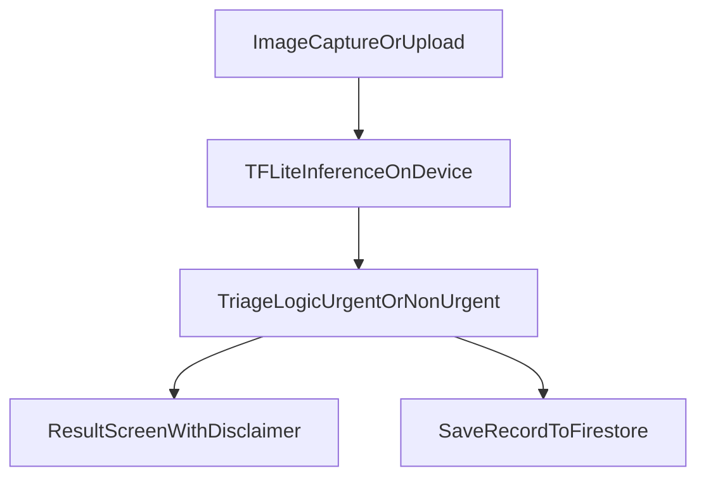

# SkinBuddy
**Built for RBC Borealis - Let's Solve it Program (Spring 2026)**

SkinBuddy is a smartphone-based computer vision triage tool designed to help individuals better assess common skin concerns using phone-quality images. Instead of building a diagnostic system, our focus is on creating a responsible, risk-based triage assistant that categorizes skin conditions into urgency levels - URGENT / NON-URGENT recommendations. The goal is to reduce uncertainty, improve early decision-making, and prioritize fairness and explainability in healthcare AI. 

[Mockup screens on Figma](https://www.figma.com/design/xQKYEueJzM710PLNcpIn78/SkinBuddy-Mobile-App?node-id=0-1&t=0sApxt4g0MXTTYA9-0)


# Team Wild West
Ipsa Manhas, Sophia Don Tranho, Kashish Gupta, Aesha Patel, Juliane Phan


## Key Features
- Flutter mobile app
- On-device ML (TFLite)
- ML training pipeline (Python)
- Modular architecture
- Firebase triage record storage (privacy-first schema)

## Architecture



## Install dependencies
- Install the Flutter SDK manually and add to PATH
- Install the Flutter SDK plugin in Android Studio Marketplace
- Run `flutter pub get`

## Firebase
- Install Firebase CLI `npm install -g firebase-tools`
- Install FlutterFire CLI `dart pub global activate flutterfire_cli` and add to PATH
- Login to Firebase `firebase login`
- Add the configuration file as `lib/firebase_options.dart`
- Records are stored using the following structure `users/{uid}/triage_records/{recordId}`

## Structure
```
users
   └── uid
       └── triage_records
           └── recordId
```

Attribute Details
```
users
 └── uid
      ├── first_name
      ├── last_name
      ├── email
      ├── age_range
      └── triage_records
           └── record_id
                ├── img_url
                ├── timestamp
                ├── related_category
                ├── texture
                ├── body_area
                ├── condition_symptoms
                ├── other_symptoms
                ├── duration
                ├── age_range
                ├── triage_level
                ├── predicted_groups
                └── explanation
```

Each triage record includes:
- body_area
- predicted_groups
- timestamp
- triage_level

## ML
cd ml
pip install -r requirements.txt
python src/train.py
python src/convert_to_tflite.py

Copy `ml/models/model.tflite` into `assets/models/model.tflite` after conversion.

## Start App
- Use `flutter run` to start the app
- Run `flutter run --dart-define=GEMINI_API_KEY=YOUR_API_KEY` to include a Gemini API key for triage explanation generation
- Run `flutter build apk --dart-define=GEMINI_API_KEY=YOUR_API_KEY` to build the APK with a Gemini API key

## Safety
- SkinBuddy provides triage recommendations only.
- Low-confidence predictions are escalated to URGENT for safety.
- Any serious or worsening skin condition should be reviewed by a clinician.
