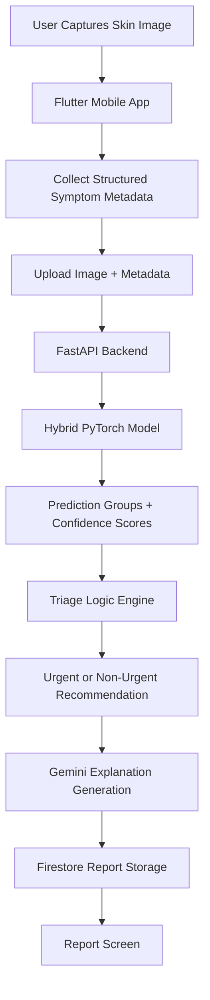

# SkinBuddy
**Built for RBC Borealis - Let's Solve it Program (Spring 2026)**

SkinBuddy is a mobile AI-assisted skin triage application designed to help individuals better assess potentially concerning skin conditions using smartphone-quality images and contextual symptom information.

Rather than providing medical diagnoses, SkinBuddy focuses on responsible, risk-aware triage recommendations by combining computer vision, structured symptom metadata, and large language model summarization to generate cautious and explainable guidance.

The system categorizes skin concerns into three urgency-based recommendation levels:

- **Nonurgent Routine Assessment**  
  Safe to wait for outpatient, primary care, or dermatology evaluation.

- **Expedited / Prompt Assessment**  
  Should be evaluated soon or same-day depending on symptoms, though not typically considered an emergency.

- **Urgent Assessment**  
  Requires urgent medical attention and may represent a potential emergency depending on accompanying symptoms.

Our goal is to reduce uncertainty, support earlier decision-making, improve accessibility to preliminary skin health assessment tools, and prioritize safety, fairness, uncertainty awareness, and explainability in healthcare AI.

[Mockup screens on Figma](https://www.figma.com/design/xQKYEueJzM710PLNcpIn78/SkinBuddy-Mobile-App?node-id=0-1&t=0sApxt4g0MXTTYA9-0)

---

# Team Wild West
- Ipsa Manhas
- Sophia Don Tranho
- Kashish Gupta
- Aesha Patel
- Juliane Phan

---

## Key Features
- Flutter mobile application
- FastAPI + PyTorch backend inference server
- Hybrid deep learning architecture
- Metadata-aware skin triage
- Firebase Authentication
- Firebase Firestore report storage
- Firebase Storage image uploads
- Gemini-generated triage explanations
- Dynamic ranked prediction groups
- Safety-first escalation logic
- Persistent triage history

---

# System Architecture



---

# ML Architecture

SkinBuddy uses a hybrid deep learning architecture combining:
- ResNet18 global image feature extraction
- Custom Fully Convolutional Residual Network (FCRN) local patch analysis
- Structured patient metadata embeddings

The model fuses:
- image features
- local texture features
- symptom/context attributes

before performing classification.

## Metadata Attributes

The model incorporates structured context data including:
- age range
- condition duration
- body area
- texture type
- condition symptoms
- systemic symptoms

This allows the model to reason beyond image-only classification.

---

# Metadata Inputs

## Related Categories
- Acne
- Growth or Mole
- Hair Loss
- Pigmentary Problem
- Rash
- Nail Problem
- Other Hair Problem
- Looks Healthy
- Other

## Texture
- Raised or Bumpy
- Flat
- Rough or Flaky
- Fluid Filled

## Body Area
- Head or Neck
- Arm
- Palm
- Back of Hand
- Torso
- Leg
- Foot
- Genitalia or Groin
- Other

## Condition Symptoms
- Bleeding
- Increasing Size
- Darkening
- Itching
- Burning
- Pain
- Bothersome Appearance

## Other Symptoms
- Fever
- Chills
- Fatigue
- Joint Pain
- Mouth Sores
- Shortness of Breath

## Duration
- 1 day
- Less than 1 week
- 1–4 weeks
- 1–3 months
- 3–12 months
- More than 1 year
- Since childhood

---

# Firebase Structure

```text
users
 └── uid
      ├── first_name
      ├── last_name
      ├── email
      └── triage_records
           └── record_id
                ├── image_url
                ├── timestamp
                ├── related_category
                ├── texture
                ├── body_area
                ├── condition_symptoms
                ├── other_symptoms
                ├── duration
                ├── age_range
                ├── triage_level
                ├── predicted_groups
                ├── explanation
                └── gemini_error
```

---

# Backend Setup

## FastAPI Server

```bash
cd backend
pip install -r requirements.txt
uvicorn main:app --reload
```

## API Endpoints

### Health Check
```text
GET /health
```

### Prediction Endpoint
```text
POST /predict
```

Accepts:
- image upload
- structured metadata JSON

Returns:
- ranked prediction groups
- confidence scores
- triage recommendation

---

# Flutter Setup

## Install dependencies
- Install the Flutter SDK manually and add to PATH
- Install the Flutter SDK plugin in Android Studio Marketplace
```bash
flutter pub get
```

## Firebase
- Install Firebase CLI `npm install -g firebase-tools`
- Install FlutterFire CLI `dart pub global activate flutterfire_cli` and add to PATH
- Login to Firebase `firebase login`
- Add the configuration file as `lib/firebase_options.dart`
- Records are stored using the following structure `users/{uid}/triage_records/{recordId}`

## Run App

```bash
flutter run --dart-define=GEMINI_API_KEY=YOUR_API_KEY
```

## Build APK

```bash
flutter build apk --dart-define=GEMINI_API_KEY=YOUR_API_KEY
```

---

# Gemini Integration

SkinBuddy uses the Gemini API to generate cautious triage-oriented summaries based on:
- model predictions
- confidence scores
- metadata inputs
- triage severity

The generated explanations:
- avoid definitive diagnoses
- acknowledge uncertainty
- encourage professional evaluation when appropriate

---

# Safety and Limitations

- SkinBuddy is not a diagnostic tool.
- The application provides triage-oriented recommendations only.
- Predictions with uncertainty may be escalated conservatively.
- AI-generated explanations are informational and not medical advice.
- Any worsening, painful, rapidly changing, or concerning condition should be evaluated by a licensed healthcare professional.
