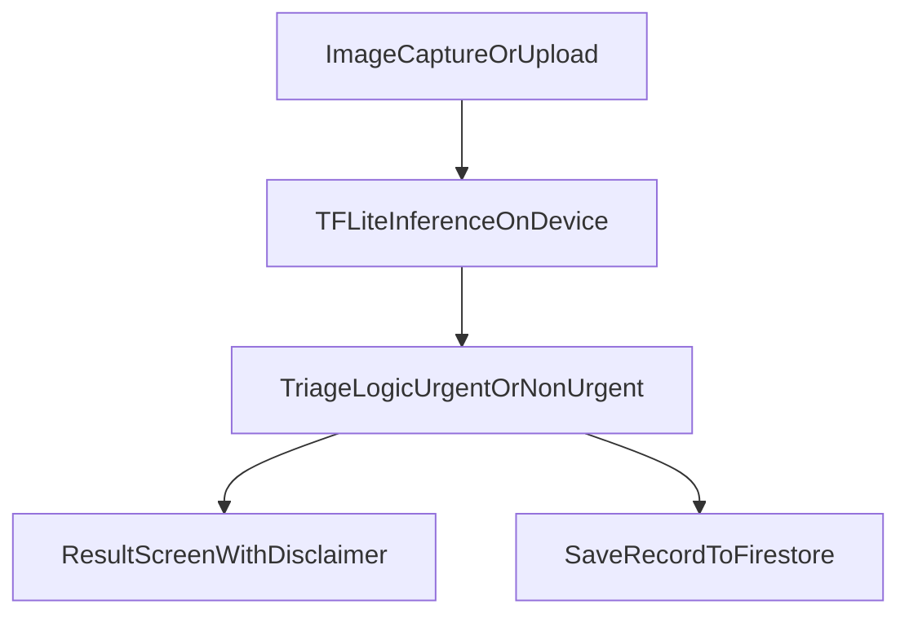

# SkinBuddy
**Built for RBC Borealis - Let's Solve it Program (Spring 2026)**

SkinBuddy is a smartphone-based computer vision triage tool designed to help individuals better assess common skin concerns using phone-quality images. Instead of building a diagnostic system, our focus is on creating a responsible, risk-based triage assistant that categorizes skin conditions into urgency levels - URGENT / NON-URGENT recommendations. The goal is to reduce uncertainty, improve early decision-making, and prioritize fairness and explainability in healthcare AI. 

[Mockup screens on Figma](https://www.figma.com/design/xQKYEueJzM710PLNcpIn78/SkinBuddy-Mobile-App?node-id=0-1&t=0sApxt4g0MXTTYA9-0)

# Team Wild West
Ipsa Manhas, Sophia Don Tranho, Kashish Gupta, Aesha Patel, Juliane Phan

## Key Features
- Flutter mobile app
- On-device ML (TFLite)
- ML training pipeline (Python)
- Modular architecture
- Firebase triage record storage (privacy-first schema)

## Architecture

## Install dependencies
- Install the Flutter SDK manually and add to PATH
- Install the Flutter SDK plugin in Android Studio Marketplace
- Run `flutter pub get`

## Start App
- Run `flutter run`

## Firebase
- Add platform Firebase config files and run `flutterfire configure`.
- Anonymous auth is used for triage record write operations.
- Records are stored at `users/{uid}/triage_records/{recordId}`.

## ML
cd ml
pip install -r requirements.txt
python src/train.py
python src/convert_to_tflite.py

Copy `ml/models/model.tflite` into `assets/models/model.tflite` after conversion.

## Safety
- SkinBuddy provides triage recommendations only.
- Low-confidence predictions are escalated to URGENT for safety.
- Any serious or worsening skin condition should be reviewed by a clinician.
