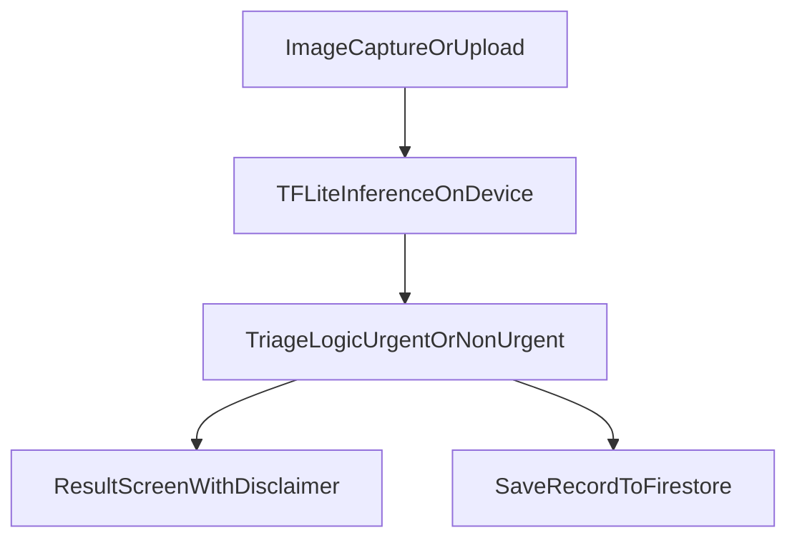

# SkinBuddy

SkinBuddy is a mobile triage tool that classifies skin conditions and outputs URGENT / NON-URGENT recommendations.

This app is a triage support assistant, not a diagnosis system.

## Key Features
- Flutter mobile app
- On-device ML (TFLite)
- ML training pipeline (Python)
- Modular architecture
- Firebase triage record storage (privacy-first schema)

## Architecture

## Run
flutter pub get
flutter run

## Firebase
- Add platform Firebase config files and run `flutterfire configure`.
- Anonymous auth is used for triage record write operations.
- Records are stored at `users/{uid}/triage_records/{recordId}`.

## ML
cd ml
pip install -r requirements.txt
python src/train.py
python src/convert_to_tflite.py

Copy `ml/models/model.tflite` into `assets/models/model.tflite` after conversion.

## Safety
- SkinBuddy provides triage recommendations only.
- Low-confidence predictions are escalated to URGENT for safety.
- Any serious or worsening skin condition should be reviewed by a clinician.
