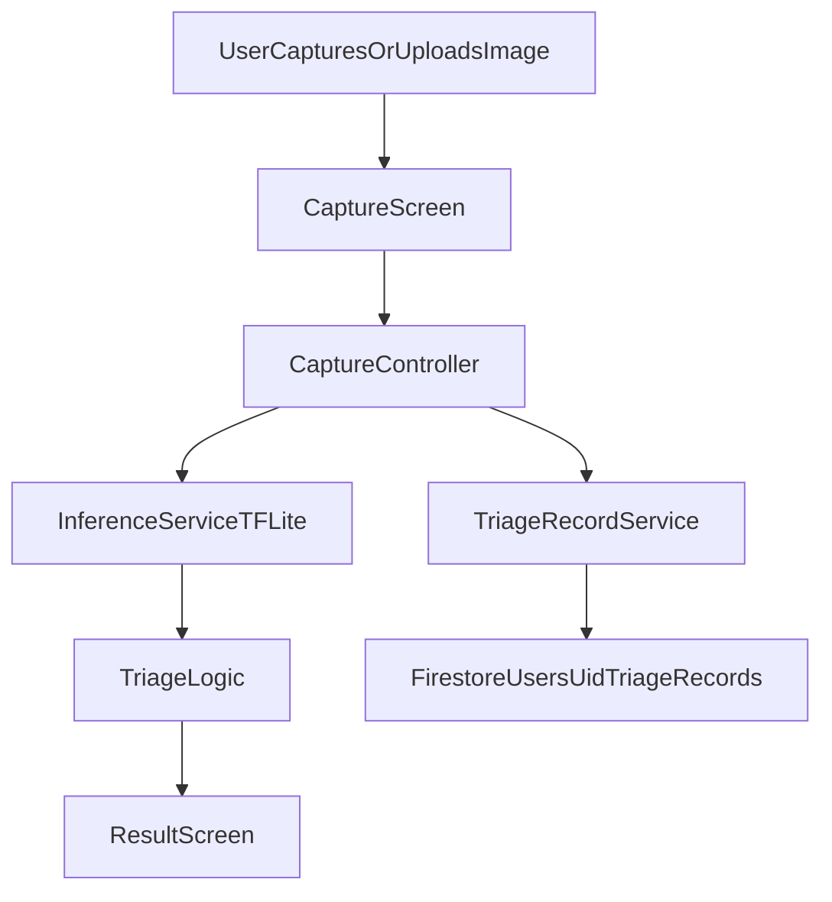

# SkinBuddy Complete Consolidated Documentation

## 1) Project Summary
SkinBuddy is a mobile triage support app for skin-condition image screening.
It predicts a class from an uploaded/captured image and returns a conservative
triage decision:
- `URGENT`
- `NON-URGENT`

This is **not** a diagnosis product. It is a triage decision-support tool.

## 2) Product Goals
- Android + iOS app from one Flutter codebase
- On-device inference with TensorFlow Lite (offline capable)
- Python ML training pipeline using transfer learning
- Firebase persistence for triage metadata (privacy-first)
- Student-friendly project structure and documentation

## 3) Scope and Non-Scope
### In Scope (v1)
- Capture from camera or gallery
- Run local TFLite inference
- Show class + confidence + triage rationale
- Apply conservative triage safety rules
- Save triage records to Firestore

### Out of Scope (v1)
- Medical diagnosis
- Treatment prescription
- Mandatory image upload to cloud

## 4) System Architecture

## 5) Folder and File Responsibilities
- `lib/main.dart`: app entry and Firebase init
- `lib/features/capture/presentation/capture_screen.dart`: image pick + analyze trigger
- `lib/features/capture/application/capture_controller.dart`: orchestration layer
- `lib/core/services/inference_service.dart`: TFLite image inference
- `lib/features/result/domain/triage_logic.dart`: urgent/non-urgent decision rules
- `lib/features/result/presentation/result_screen.dart`: result rendering + disclaimer
- `lib/core/services/triage_record_service.dart`: Firestore record write + anonymous auth
- `lib/core/constants/triage_config.dart`: triage thresholds and urgent labels
- `ml/src/train.py`: model training + validation + metrics
- `ml/src/convert_to_tflite.py`: export and model artifact verification

## 6) Data Model (Firestore)
Collection path:
- `users/{uid}/triage_records/{recordId}`

Fields:
- `label`
- `confidence`
- `triageOutcome`
- `triageReason`
- `modelVersion`
- `appVersion`
- `createdAt`
- `imagePath` (optional, only if consent is enabled)

## 7) End-to-End Runtime Flow
1. User captures/selects an image.
2. App preprocesses image to model input size and normalization.
3. TFLite model predicts class scores.
4. Top class and confidence are computed.
5. Triage rules evaluate urgency:
   - high-risk class => urgent
   - low-confidence => urgent
   - otherwise non-urgent
6. Result UI displays prediction, confidence, rationale, disclaimer.
7. Triage record metadata is persisted in Firestore.

## 8) ML Pipeline
Training data format:
- `ml/data/<class_name>/<images>`

Training command:
- `python src/train.py`

Training behavior:
- train/validation split (80/20)
- MobileNetV2 transfer learning
- early stopping and model checkpoint
- evaluation on validation set
- classification report and confusion matrix output

Conversion command:
- `python src/convert_to_tflite.py`

Artifacts:
- `ml/models/saved_model`
- `ml/models/best_model.keras`
- `ml/models/model.tflite`

Deploy artifact:
- Copy `ml/models/model.tflite` to `assets/models/model.tflite`

## 9) Setup Instructions
### Prerequisites
- Flutter SDK stable
- Python 3.10+
- Android Studio + SDK
- Xcode for iOS (on macOS)
- Firebase project (Spark/free tier is enough for v1)

### Mobile Setup
1. `flutter pub get`
2. Add Firebase config files:
   - Android: `google-services.json`
   - iOS: `GoogleService-Info.plist`
3. Run `flutterfire configure` if needed
4. Run app: `flutter run`

### ML Setup
1. `cd ml`
2. `pip install -r requirements.txt`
3. `python src/train.py`
4. `python src/convert_to_tflite.py`
5. Copy generated TFLite model to Flutter assets

## 10) Safety and Clinical Positioning
- Always show: "triage support only, not diagnosis"
- Low-confidence predictions escalate to urgent by default
- Risk-label mapping escalates potentially severe classes
- For worsening symptoms, direct user to clinician/emergency care

## 11) Student Onboarding Playbook
### Day 1 (Understand + Run)
- Read this file and `README.md`
- Run app locally
- Run ML training once and export model
- Verify result screen and Firestore write

### Day 2 (Feature Work)
- Pick one task from coder task board:
  - unit tests for triage logic
  - permission/error UX improvements
  - localization

### Day 3 (Quality + Safety)
- Validate confusion matrix and class recall
- Review triage thresholds
- Verify disclaimer text in UI

## 12) Definition of Done for New Changes
- Builds on Android and iOS
- No new lint or runtime errors
- Triage logic remains conservative under uncertainty
- Firestore schema unchanged or migrated safely
- Docs updated if behavior changed

## 13) Recommended Next Improvements
- Add automated tests for `TriageLogic` and controller flow
- Add explicit consent screen before storing any image-linked field
- Add robust Firestore security rules and emulator tests
- Add model registry metadata (version, metrics, date)
- Add CI checks for Flutter analyze/test and Python lint/tests

## 14) Quick Troubleshooting
- Model not loading:
  - confirm `assets/models/model.tflite` exists
  - confirm asset path in `pubspec.yaml`
- Firebase write failing:
  - confirm anonymous auth enabled
  - confirm Firestore rules and app initialization
- Inference quality poor:
  - verify class balance and preprocessing consistency
  - re-check labels order between model and `labels.txt`
