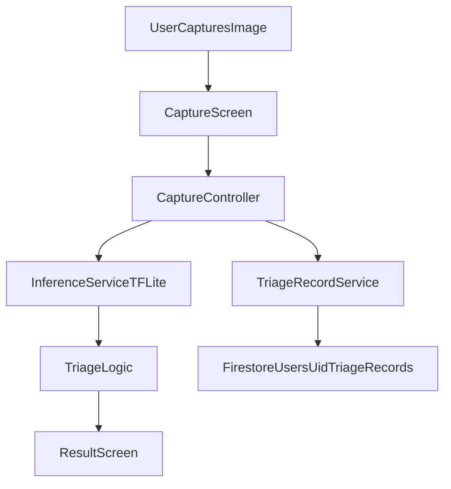

# Architecture

## High-Level Flow

## Mobile Layers
- `presentation`: user interface screens (`capture_screen.dart`, `result_screen.dart`)
- `application`: flow orchestration (`capture_controller.dart`)
- `domain`: triage decision rules (`triage_logic.dart`)
- `core/services`: infrastructure (`inference_service.dart`, `triage_record_service.dart`)
- `core/constants`: tunable values (`triage_config.dart`)

## Inference Pipeline
1. User picks/captures image.
2. Image is resized to model input dimensions.
3. Pixel values are normalized and fed to TFLite interpreter.
4. Top class and confidence are returned.
5. Triage rules map class + confidence to urgent/non-urgent outcome.

## Persistence Model (Firestore)
- Collection path: `users/{uid}/triage_records/{recordId}`
- Stored fields:
  - `label`
  - `confidence`
  - `triageOutcome`
  - `createdAt`
- `imagePath` is only written if explicit consent is enabled.

## Safety Controls
- Conservative escalation for low confidence
- Explicit "triage-only, non-diagnostic" disclaimer returned by domain layer
- Risk-label list (infection-like classes) always escalates to urgent
