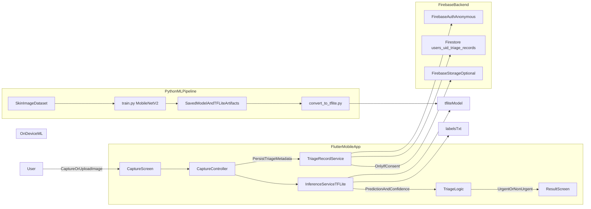

# SkinBuddy System Architecture Diagram

## Notes
- Inference runs on device by default for privacy and offline support.
- Firestore stores triage metadata, not diagnosis.
- Image storage is optional and should require explicit consent.
- Low-confidence outputs should escalate to urgent by triage policy.
